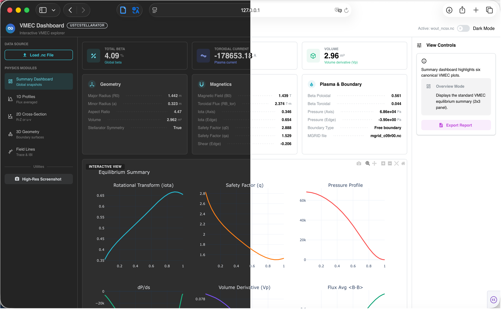

# VMECdash

An interactive Dash application for exploring VMEC `wout_*.nc` stellarator equilibria.  
It reconstructs magnetic surfaces with JAX, renders 1‑D/2‑D/3‑D plots and so on, motivated by the original MATLAB tool **VMECplot.m**.

**Motivation:** Quickly inspect the VMEC equilibrium quantities of interest **without relying on** difficult-for-starter-to-compile programs (such as **libstell**) or memory-heavy commercial software (such as **MATLAB**).

[](example/summary.png)

---
## Features

- **File upload** for standard VMEC `wout` NetCDF output.
- **Summary dashboard** with key scalar diagnostics and highlighted metadata (free/fixed boundary, mgrid file, etc.).
- **1‑D profiles** for rotational transform, safety factor, pressure, volume derivative, beta metrics, and more.
- **2‑D visualisations**:
  - R‑Z cross sections with geometry or interpolated scalar fields.
  - θ‑ζ flux-surface contours across a field period.
- **3‑D flux surfaces** with optional coordinate‑free background shading.
- **Field lines viewer** for $\alpha-\zeta$ coordinates on selected flux
  - A nice choice for visualising magnetic ripple
  - 2D plots of $|B|(\alpha, \zeta)$
  - 1D plots of single period field line traces with different initial $\alpha$ values
  - Single field line transistions.
- **JAX acceleration** for geometry reconstruction.

---

## Requirements

Python 3.10+ is recommended. Install dependencies with conda:(optional)

```bash
conda activate your_env_name
pip install -r requirements.txt
```

> **Note for JAX:** If you don't have a GPU/TPU or your gpu is not supported for FP64(like metal), then simply running `pip install jax[cpu]` to  install the CPU-only version is good enough.
> GPU/TPU wheels require platform-specific instructions from the [JAX documentation](https://github.com/google/jax#pip-installation).

---

## Running the App

```bash
python VMECdash.py
```

Dash defaults to `http://127.0.0.1:8050/`. The layout is responsive, so you can resize the browser to focus on plots or the control sidebar.


---

## Usage Tips

1. **Upload** a VMEC NetCDF file (`wout_*.nc`) via the drag‑and‑drop area in the sidebar.
2. Use **Visualization Mode** to switch between:
   - **Summary Dashboard** (shows statistics + multi-panel plots),
   - **1D Profiles**, **2D Cross Sections**, **2D Flux Surfaces**, and **3D Geometry**.
3. Adjust **sliders** for toroidal angle (`phi`), flux surface index (`s`), and choose different physical quantities from the dropdowns.
4. Toggle **Coordinate-free background** in 3‑D mode for clean screenshots.
5. Click **Download Plot** to export the currently visible figure as a PNG.

The app caches equilibrium metadata, so switching modes or variables is fast.  
For heavy 2‑D physics overlays, a pre-computation step runs on the server while keeping the UI responsive.

---

## Repository Layout

| Path               | Description                                                      |
| ------------------ | ---------------------------------------------------------------- |
| `VMECdash.py`| Main Dash entry point (layout + callbacks).                      |
| `vmec_jax.py`      | JAX-powered data processor for VMEC equilibria.                  |
| `views/`           | Modular UI components (overview, profiles, 2D/3D, fieldlines).  |
| `ui/`              | Shared UI helper components.                                    |
| `requirements.txt` | Python dependencies.                                             |
| `example/wout_PO.nc`       | Example VMEC equilibrium (use your own files for new cases).     |

---

## TroubleShooting
Feel free to open issues or pull requests to add new physical quantities, UI tweaks, or performance optimisations. Enjoy exploring your VMEC equilibria! 

## Next step
- Add jax-based boozer coordinate transformation.
- Fast evaulation of EffetiveRipple, GammaC, maybe slow without gpu.