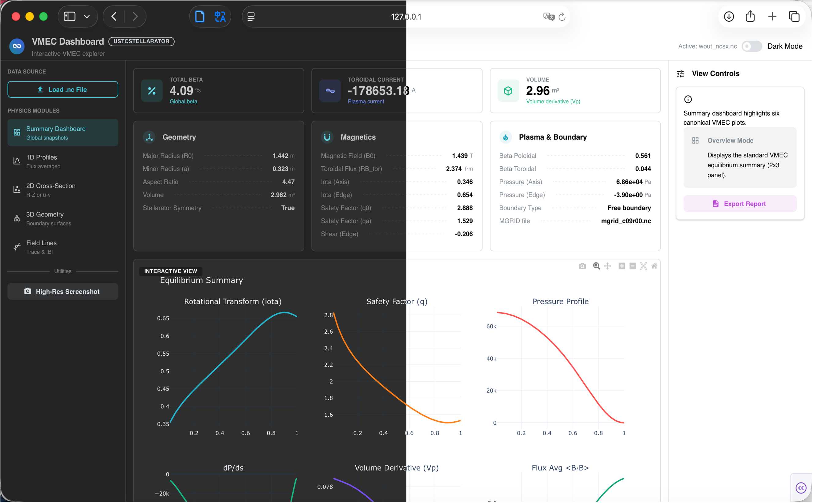

# VMECdash

**By [USTC Stellarator Lab](https://github.com/USTCstellarators) — MIT License**

> [!TIP]
> **Now available in VS Code.** VMECdash also runs as the backend of the
> **[VMECdash Viewer](https://marketplace.visualstudio.com/items?itemName=HengqianLiu.vmecdash-viewer)**
> extension, installable from the VS Code Marketplace. Run `pip install vmecdash` in the
> Python environment VS Code uses, install the extension, then open a `wout*.nc` file with
> **VMECdash: Open Preview** to inspect it without leaving the editor. It works over
> Remote-SSH too. See [VS Code extension](#vs-code-extension).

An interactive Dash application for exploring VMEC `wout_*.nc` stellarator equilibria.  
It reconstructs magnetic surfaces with JAX, renders 1‑D/2‑D/3‑D plots and so on, motivated by the original MATLAB tool **VMECplot.m**.

**Motivation:** Quickly inspect the VMEC equilibrium quantities of interest **without relying on** difficult-for-starter-to-compile programs (such as **libstell**) or memory-heavy commercial software (such as **MATLAB**).

[](example/summary.png)

---
## Features

- **File upload** for standard VMEC `wout` NetCDF output.
- **Summary dashboard** with key scalar diagnostics and highlighted metadata (free/fixed boundary, mgrid file, etc.).
- **1‑D profiles** for rotational transform, safety factor, pressure, volume derivative, beta metrics, and more.
- **2‑D visualisations**:
  - R‑Z cross sections with geometry or interpolated scalar fields.
  - θ‑ζ flux-surface contours across a field period.
- **3‑D flux surfaces** with optional coordinate‑free background shading.
- **Field lines viewer** for $\alpha-\zeta$ coordinates on selected flux
  - A nice choice for visualising magnetic ripple
  - 2D plots of $|B|(\alpha, \zeta)$
  - 1D plots of single period field line traces with different initial $\alpha$ values
  - Single field line transistions.
- **JAX acceleration** for geometry reconstruction.

---

## Requirements

Python 3.10+ is recommended. Install dependencies with conda:(optional)

```bash
conda activate your_env_name
pip install -r requirements.txt
```

> **Note for JAX:** If you don't have a GPU/TPU or your gpu is not supported for FP64(like metal), then simply running `pip install jax[cpu]` to  install the CPU-only version is good enough.
> GPU/TPU wheels require platform-specific instructions from the [JAX documentation](https://github.com/google/jax#pip-installation).

---

## Running the App

```bash
python VMECdash.py
```

Dash defaults to `http://127.0.0.1:8050/`. The layout is responsive, so you can resize the browser to focus on plots or the control sidebar.

The packaged entry point is also available after installation:

```bash
pip install -e ".[dash]"
vmecdash serve
```

---

## VS Code Extension

**[VMECdash Viewer](https://marketplace.visualstudio.com/items?itemName=HengqianLiu.vmecdash-viewer)**
on the VS Code Marketplace previews VMEC equilibria inside the editor, using the `vmecdash`
Python package as its backend.

1. Install the backend in the Python environment VS Code uses: `pip install vmecdash`.
2. Install **VMECdash Viewer** from the Extensions view (search "VMECdash").
3. Open a `wout*.nc` file with **VMECdash: Open Preview** from the Command Palette, or
   right-click it → *Open With…* → *VMECdash Preview*.

If VS Code picks the wrong interpreter, run **VMECdash: Select Python Interpreter** or set
`vmecdash.pythonPath`. Under Remote-SSH, install `vmecdash` in the remote environment.

How it fits together:

- a Dash-free Python backend at `python -m vmecdash.vscode_backend --stdio`;
- the extension source under `extension/`;
- a Custom Readonly Editor for `wout*.nc` files;
- a Webview UI that renders backend Plotly figures with bundled `plotly.min.js`.

For extension development, install the Python package in editable mode in the interpreter VS Code should use:

```bash
pip install -e .
```

Then open `extension/` as a VS Code extension development project (F5 launches it) or package it as a VSIX.


---

## Usage Tips

1. **Upload** a VMEC NetCDF file (`wout_*.nc`) via the drag‑and‑drop area in the sidebar.
2. Use **Visualization Mode** to switch between:
   - **Summary Dashboard** (shows statistics + multi-panel plots),
   - **1D Profiles**, **2D Cross Sections**, **2D Flux Surfaces**, and **3D Geometry**.
3. Adjust **sliders** for toroidal angle (`phi`), flux surface index (`s`), and choose different physical quantities from the dropdowns.
4. Toggle **Coordinate-free background** in 3‑D mode for clean screenshots.
5. Click **Download Plot** to export the currently visible figure as a PNG.

The app caches equilibrium metadata, so switching modes or variables is fast.  
For heavy 2‑D physics overlays, a pre-computation step runs on the server while keeping the UI responsive.

---

## Repository Layout

| Path                          | Description                                                            |
| ----------------------------- | ---------------------------------------------------------------------- |
| `VMECdash.py`                 | Standalone Dash entry point (`python VMECdash.py`).                    |
| `vmecdash/core/`              | JAX-powered data processor for VMEC equilibria.                        |
| `vmecdash/renderers/`         | Plotly figure builders, shared by the Dash app and the VS Code backend. |
| `vmecdash/view_schema.py`     | View and control registry that drives the VS Code webview.             |
| `vmecdash/theme.py`           | Colour-scale policy, palettes and the Plotly template.                 |
| `vmecdash/dash_app/`          | Dash layout, controls and callbacks.                                   |
| `vmecdash/vscode_backend.py`  | Dash-free stdio backend for the VS Code extension.                     |
| `extension/`                  | VS Code extension (TypeScript host + webview).                         |
| `tests/`                      | Test suite (`pytest`).                                                 |
| `example/wout_PO.nc`          | Example VMEC equilibrium (use your own files for new cases).           |

---

## TroubleShooting
Feel free to open issues or pull requests to add new physical quantities, UI tweaks, or performance optimisations. Enjoy exploring your VMEC equilibria! 

## Next step
- Add jax-based boozer coordinate transformation.
- Fast evaulation of EffetiveRipple, GammaC, maybe slow without gpu.

---

## License

MIT © USTC Stellarator Lab and contributors. See [LICENSE](LICENSE).

The VS Code extension bundles [Plotly.js](https://github.com/plotly/plotly.js)
(`extension/media/plotly.min.js`), which is also distributed under the MIT License
(© Plotly, Inc.).
